# Wallpapers

Auto-generated gallery — every push to `main` regenerates this README via
GitHub Actions (`scripts/generate_readme.py`), so new images show up automatically.

Total: **31** images.

## Gallery

|  | `0385.jpg` |
|  | `1771852579718f.png` |
|  | `ambxst-01.png` |
|  | `ambxst-08.png` |
|  | `ambxst-09.png` |
|  | `ambxst-10.png` |
| 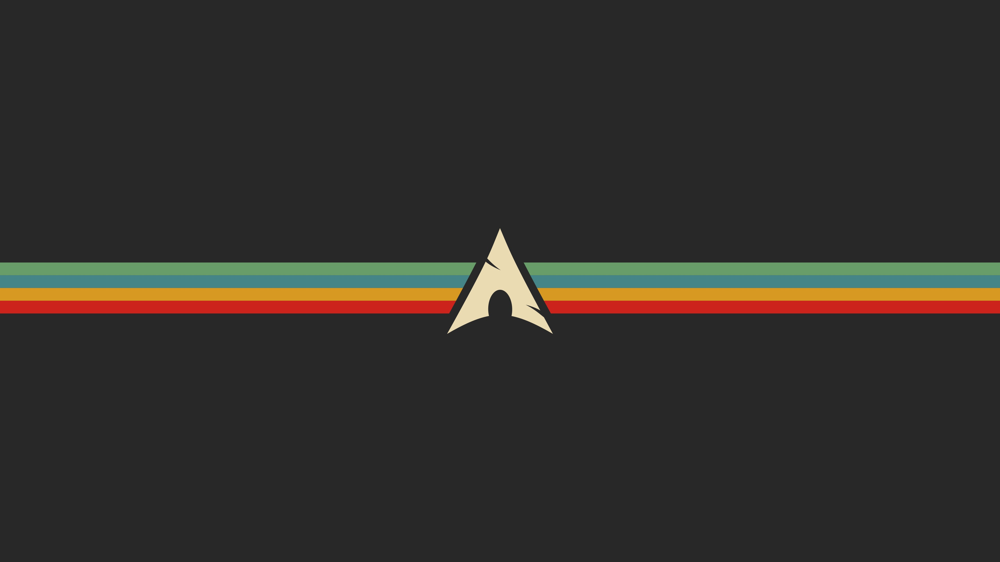 | `arch.jpg` |
|  | `big_sur.jpg` |
|  | `capy.png` |
|  | `cat-avatar.jpg` |
| 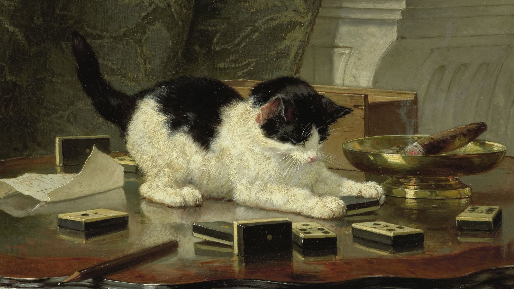 | `cat.jpg` |
|  | `colors.jpg` |
| 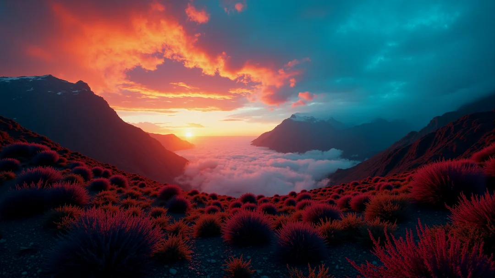 | `firstlight.png` |
| 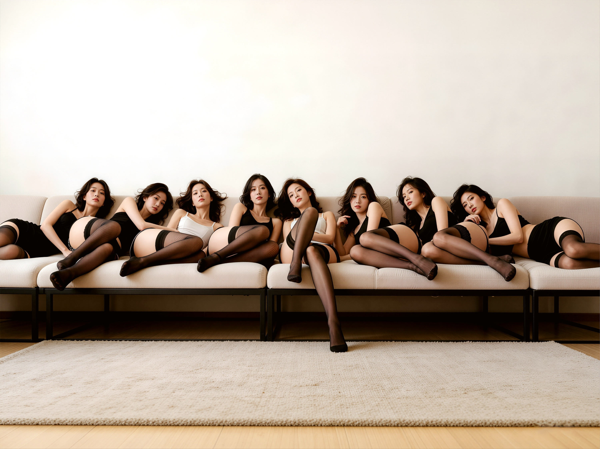 | `g.jpg` |
|  | `girl.png` |
| 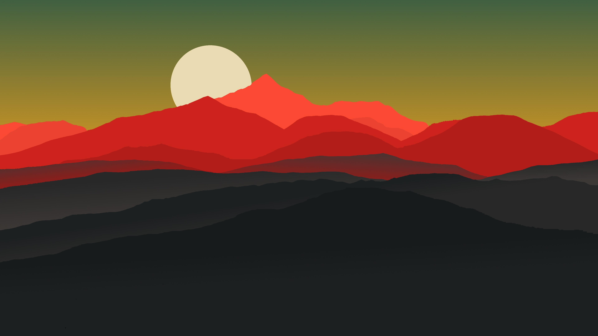 | `hightmoon.jpg` |
|  | `home127-dark.jpg` |
| 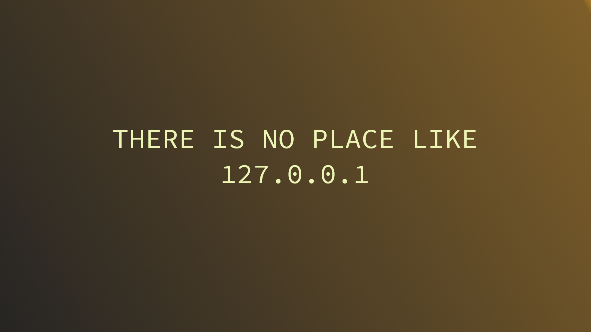 | `home127-light.jpg` |
|  | `kita.png` |
| 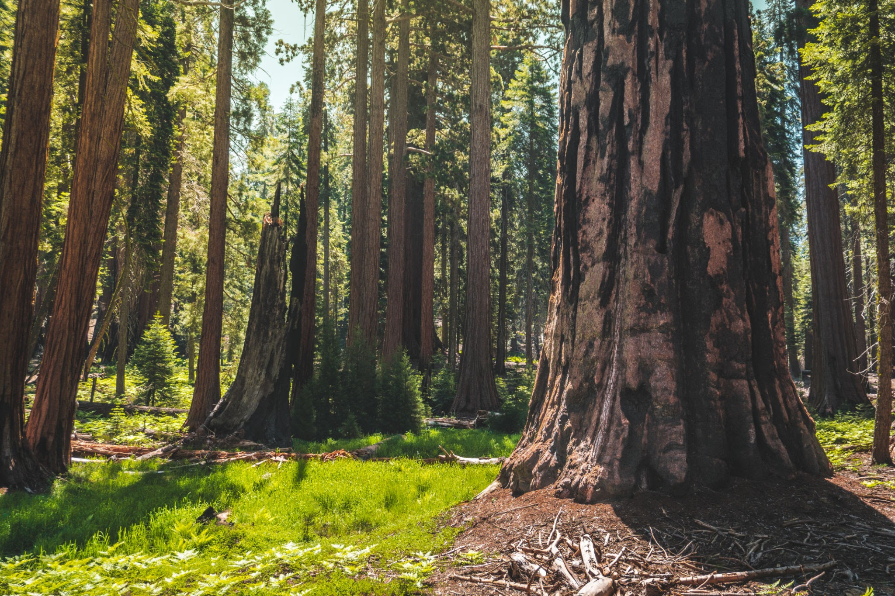 | `licensed-image.jpeg` |
| 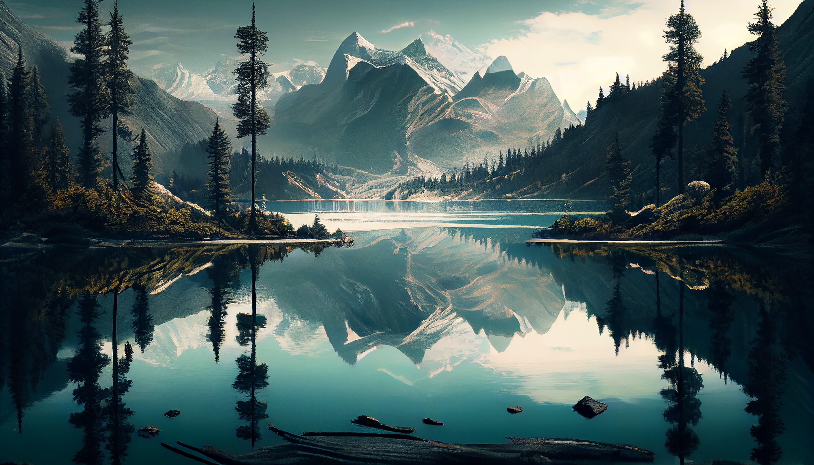 | `mountain.jpg` |
|  | `shin1.png` |
| 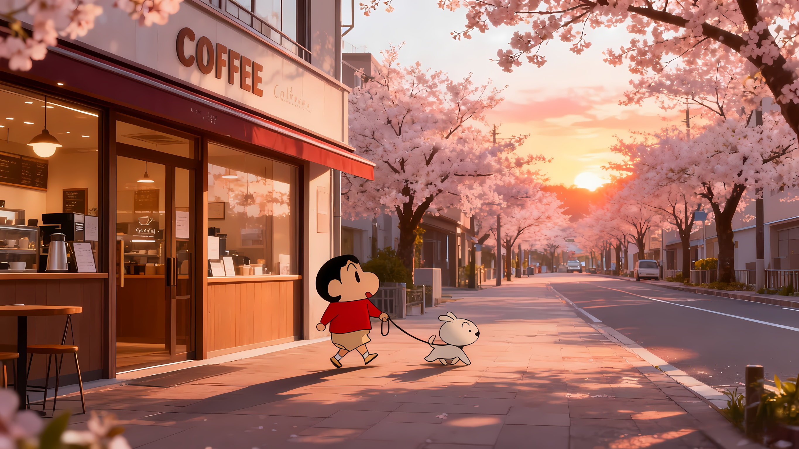 | `shin2.png` |
|  | `shin3.png` |
|  | `ss.png` |
|  | `superman.png` |
| 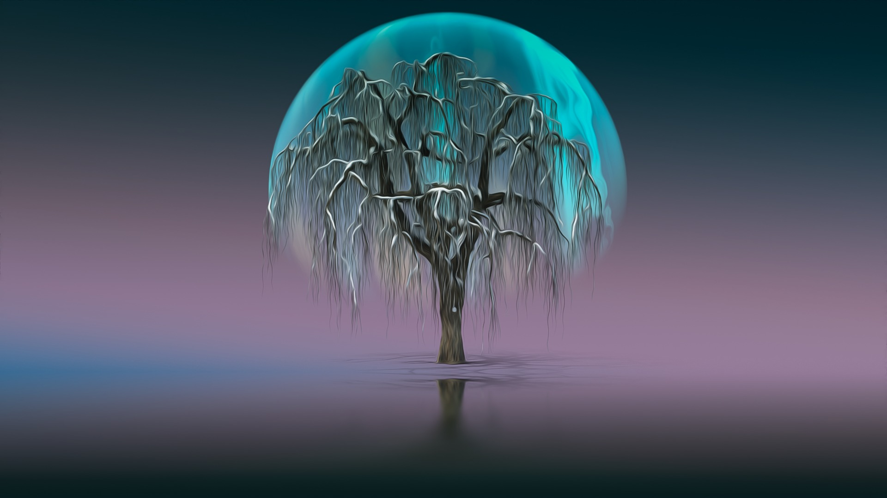 | `tree.jpg` |
|  | `vangoth.png` |
| 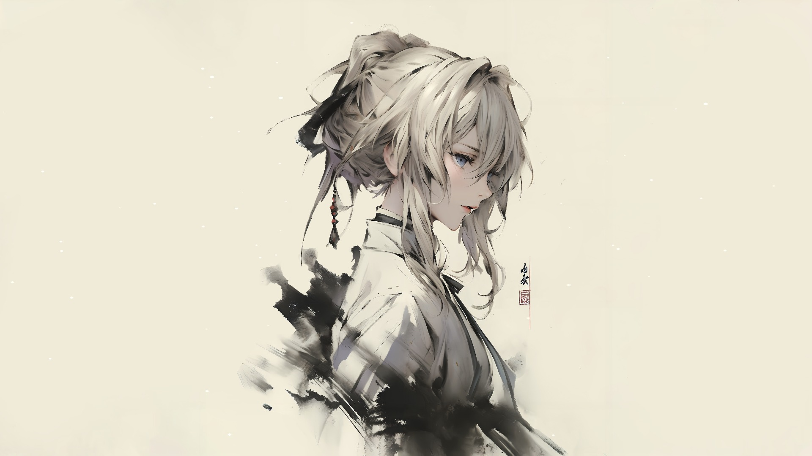 | `violet.jpg` |
|  | `wall_1.jpg` |
|  | `water.jpeg` |
